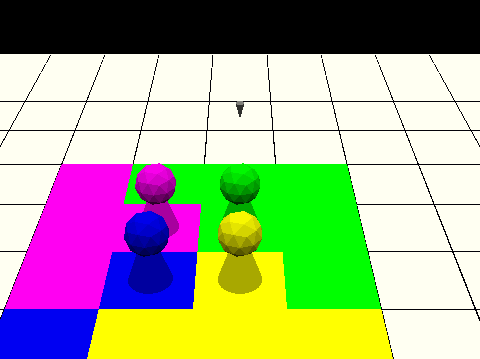

# (TODO: your game's title)

Author: Jianxiang Li, Zhengyang Xia

Design: A turn-based strategy battle royale game where players can either strike early or accumulate MP for heavier attacks.

Networking: (TODO: How does your game implement client/server multiplayer? What is transmitted? Where in the code?)

Screen Shot:

How To Play:
Goal: Beat all other players and survive to be the last one standing.

Basic Rules: 

Once we have all the players joining the game, the game starts.\
Each turn every player will have 20s(simultaneously) to choose a action to take.
The actions that player can take includes moving, making an attack, defending, charging MP, and do nothing.\
Making an attack:\

Sources: (TODO: list a source URL for any assets you did not create yourself. Make sure you have a license for the asset.)\

Scene Modified from https://github.com/Chipxiang/Dangerous-Midnight-Treat/blob/master/scenes/game_map.blend\
This game was built with [NEST](NEST.md).

